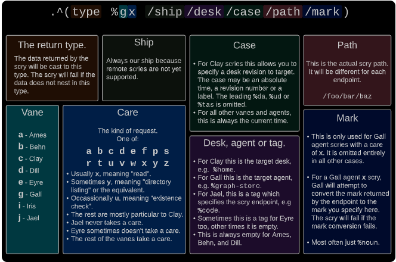
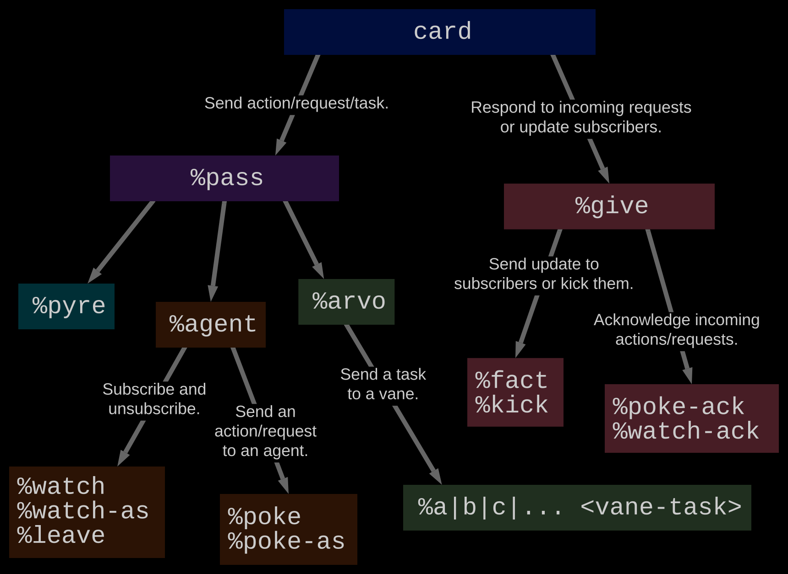
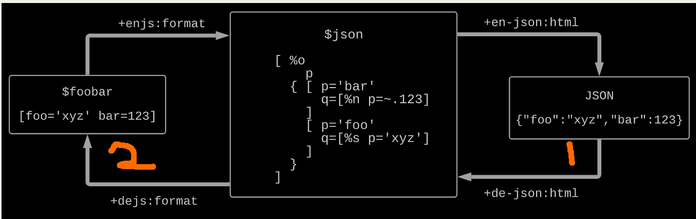
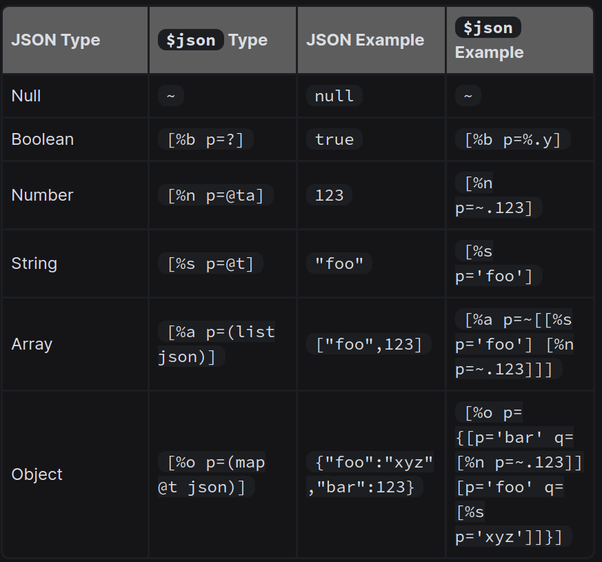
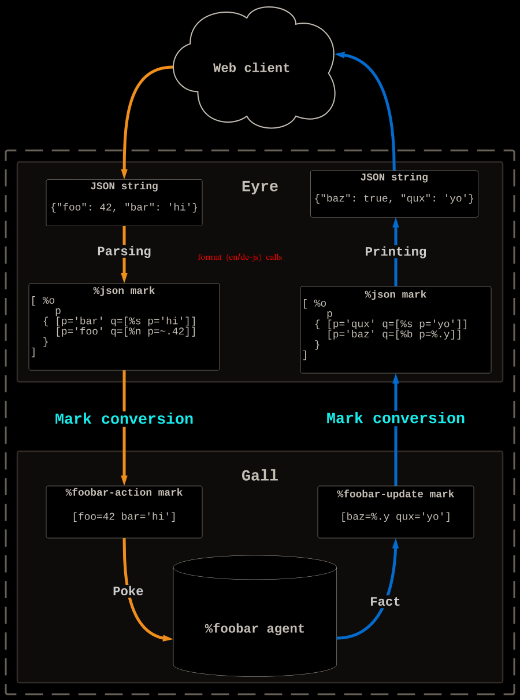

## App School Notes:

## Glossary:

- Arvo: Urbit's OS.
- Noun: A noun is an atom (a single value +ve integer), or a cell of two nouns.
- Core: A special cell that pares operations to data.
    - Arms: The comptation portion of a core.
    - Legs: THe data portion of a core.
- Door: A Core with a sample pinned to the head.
- Vanes: These are core Arvo (OS) modules that perform system level operations. Some important vanes:
    - Ames: P2P networking.
    - Behn: Timer Vane
    - Eyre: HTTP Vane
    - Gall: Application Vane
- Scry: Read only REQ to the namespace of a local vane or agent. 
- cage: a cell of [mark  vase]
    - mark: a @tas term used to mark data.
    - vase: data payload that is packaged in some way (?).

##  Lesson 0: Arvo and Creating Simple Agents:

- Def: App: the entire desk you are distributing.
- Def: Agent: A single process running on a particular Desk.
- The goal of any operating system is to define an expected way to load and execute programs.
- Urbit's OS is called **Arvo**, which is an event handler and dispatcher.  It provides a userspace app framework called Gall, which requires a standard application interface. It also gives you access to an environment, state management, and p2p software distribution.
- A Gall agent is both a noun and a core.
- Analogy of an Agent: It is a state-machine. It must respond to all possible outputs, and act accordingly to transition to another 
state.
    - It is a piece of software that maintains and distributes a stateful structure.
    - It has an interface that lets other entities interact with it.
    - It transitions based on a predefined function and input, and must guarentee that the next state is valid.

#### The Agent as a State Machine:

- An agent is a piece of software that is primarily focused on maintaining and distributing a piece of state with a defined structure. It exposes an interface that lets programs read, subscribe to, and manipulate the state. Every event happens in an atomic transaction, so the state is never inconsistent. 
- An agent is permanent and addressable -- a running program can talk to an agent just by naming it. An agent can perform IO, unlike most databases. This is a critical part of an agent: it performs IO along the same transaction boundaries as changes to its state, so if an effect happens, you know that the associated state change has happened
- Like a state machine, any input could happen at any time, and it must react coherently to that input


### The Agent Core:

- A Gall agent is a door with 10 arms. Each arm being responsible for handling specific events.
    - Analogy: A React/JS framework that handles user interaction events.

- The (most-basic) default agent is below:

```
|_  =bowl:gall
++  on-init   `..on-init
++  on-save   !>(~)
++  on-load   |=(vase `..on-init)
++  on-poke   |=(cage !!)
++  on-watch  |=(path !!)
++  on-leave  |=(path `..on-init)
++  on-peek   |=(path ~)
++  on-agent  |=([wire sign:agent:gall] !!)
++  on-arvo   |=([wire sign-arvo] !!)
++  on-fail   |=([term tang] `..on-init)
--
```

#### Some Important Terms:

- Vase:  is a data container tha tholds a pair of type and value.  This is used to send/recieve data, and interpret the data that has been sent.  The type is applied to the value, to interpret it.
- Cage:  A pair of mark and a vase. A mark bein a text tag that corresponds to a dynamic type in a vase. Marks are akin to filetypes, and are stored in the /mar folder of your desk.
- Path:  a list of knots. Exactly what you would expect.
- Wire: An alias of a path. Acts as a unique identifier for a request.
-  \``..on init`: Recall back-tic notation denotes a **unit**.  When  ++on-init is run, the core is built, and a unit with the core itself is passed back.
- sign/sign-arvo:  these are incoming events (in response to a standing request for data (?)).
- tang:  a formatted print structure.


#### Basic Summaries of Arms:

0) The Bowl: This is our main sample pinned to our gall core.  It contains a number of fields:
    - Basic Agent Info:
        - our:  host ship
        - src:  guest ship
        - dap:  agent name
    - Resource Payload:
        - act:  change number for agent.
        - eny:  entropy bits
        - now:  the current time
        - byk:  load source (?)
    - Subscription Payload:
        - wex:  outgoing subscriptions
        - sup:  incoming subscriptions.
        - sky: bindings:

1) State Management: For initing and upgrading an agent.
    - on-init:  first-time startup arm. Returns the whole arm in a unit.
    - on-save: envases, produces a vase of the current state (before an upgrade).
    - on-load: unwraps the old vase, makes state changes (after an upgrade).

2) Request Handlers:  These handle internet requests.
    - Note: Gall agents implement a dataflow computing model (push data downstream to subscribers).
    - on-poke:  single-instance interaction - like a data status request.
    - on-watch: registers a new subscription.
    - on-leave: quit a subscription / registers a dropped subscriber.

3) Response Handlers: These handle agent responses (info sent back), that our agent receives from making its own requests.
    - on-agent: Req agknow. and subscription updates from other agents. Recieve data from another agent.
    - on-arvo: Handles vane responses, Recieve data from Arvo OS. An arm that basically makes system calls.

4) Scry Handler:
    - on-peek: local read-only requests. Single time data request. Can only read data - never modify.

5) Failure Handler: 
    - on-fail: RT error crashing, handles crash reports from Gall.

- Most of the Gall arms produce a cell that contains two types of data:
    - Cards: A list of effects.
    - Modified Core, usually with the same battery but a modified payload (read: subject for the battery).

#### Understanding Key Agent Data Types [1]:

- Our different components communicate to one another - this can be on the same machine, or a remote machine.
- Just like a data stream with a MIME-Type, we need to encode bits and send them in packets to other agents. 

##### Vase:

- A Vase: A cell of <type> and noun.
    - They encapsulate dynamically typed data (they allow you to move around where the type isn't known beforehand).
        - Practically, almost all data sent to/from agents will involve vases, or be wrapped in them.
        - **Arm Def:**  `+$  vase  [p=type q=*]`
    - Make a Vase with Zapgar (!>)
        - Usage:  `!>(  <noun>  )`.
        - When you make a vase, it creates a cell with inferred datatype as the first slot, and data as second slot (pinned to face q)
    - Unpack a Vase with Zapgal (!<):  The rune uses the type as a mold, and tries to cast the data inside the vase as that type.
        - Usage: !<  <type>  <vase>
        - **When used:**  on data in a `card` that comes from other ships and agents...
    - You can make any noun a vase, even complex cells(!)
```
!>([foo="bar" 55 (limo ~[1 2 3]) [%myterm  "Hello!!"] ])

[ #t/[foo="" @ud ^#4.?([i=@ud t=#4] ^#3.?([i=@ud t=#3] it(@ud))) %myterm ""]
  q=[[98 97 114 0] 55 [1 2 3 0] 120.338.095.831.405 72 101 108 108 111 33 33 0]
]

```

##### Mark:

- is just a kind of term (@tas), that specifies a clay filetype. All marks have a mark file in /mar of your fake zod.
- A mark of type %foo corresponds to `/mar/foo/hoon`


##### Cage:

- A cage is a cell of a mark and a vase. 
- Cages typically hold vases. 
- Structure:  `[%mark [<vase...>]]`
    - To examine the vase, you can walk the binary tree to address +3.cage...


### Examining the Bravo Core (Extended):

```
/+  default-agent, dbug
|%
+$  versioned-state
  $%  state-0
  ==
+$  state-0
  $:  [%0 values=(list @)]
  ==
+$  card  card:agent:gall
--
%-  agent:dbug
=|  state-0
=*  state  -
^-  agent:gall
|_  =bowl:gall
+*  this  .
    default  ~(. (default-agent this %|) bowl)
++  on-init
  ^-  (quip card _this)
  ~&  >  '%bravo initialized successfully'
  =.  state  [%0 *(list @)]  [~ this]
++  on-save   on-save:default
++  on-load   on-load:default
++  on-poke   on-poke:default
++  on-arvo   on-arvo:default
++  on-watch  on-watch:default
++  on-leave  on-leave:default
++  on-peek   on-peek:default
++  on-agent  on-agent:default
++  on-fail   on-fail:default
--
```

#### Note the following:

- In this core, we have imported a default library which just uses standard arms (instead of us having to write it out). What is significant is the stuff on the top. Some observations:

- `/+  default-agent, dbug`: We import two libraries.
-  Core (|%):  
    - The +$ arms define types and structures we will use later.
- `%-  agent:dbug=|  state-0=*  state  -^-  agent:gall`: We wrap our gall core in a debug agent - starting with a gate/function call.
- Whats inside /lib/default-agent/hoon?
    - Our 10 default arms are stored as gates in default-agent's arms...They are fleshed out, and have good pretty-printing to help
    us understand things in Dojo console.
- Aliasing/Pinning:
    - `this` keyword: is pinned to the subject (.) with +*.
    - `default  ~(. (default-agent this %|) bowl)` we pin default to a %~ call, with subject compiled core, and bowl attached.

## Lesson 1: Arvo Services:

- "Arvo is the Urbit OS and kernel which is written in Hoon, compiled to Nock, and executed by the runtime environment and virtual machine Vere. Arvo has currently nine kernel modules called vanes."
- Arvo is the OS and Kernel of Hoon, which compiles to the Turing Complete Nock low-level language.

### State Machine:

- The core operation of Arvo (for any system like call), is to execute the Transition Function:

$$TF(oldState,Events) \rightarrow  (effects, newState) $$

- Each Vane has its own state - and all the vane states are nested in Arvo's state object.
- Arvo also handles the scry system, inter-vane messaging. Arvo just deals with state management, and routing cards to different vanes.

### Events and Event Log:

- Arvo's current state is the end result of the events which have operated on it. 
- Formal State: A log of events, in a linked list of nouns. It can be recomputed from the beginning at any time.
- Events have two key properties that give us guarentees for state transitions:

1) **Atomicity:** The event is written to the event log, and only then the effects of the event are applied.

2) **Consistency:**  The database is in a consistent state before an effect, and after an effect. All transitions of state are result in a valid database.

- Because we write to log before performing the side-effect, even if we crash, we can be sure the side-effect will occur.
- "It behooves one to think of Arvo as being a stateful packet transceiver rather than an ordinary computer—events are never guaranteed to complete, even if one can prove that the computation would eventually terminate"
- Arvo's causal stack is called a `duct`.
    - this is a list of paths, which represents a step in the cause chain.
    - think of an event as a tree - where the internal nodes are different vanes/arvo performing work, and leafs are Unix events (for the end side-effects on our system).
- This causal stack is to avoid **event spaghetti**.
    - Keeping track of every event's cause creates a clear chain of computation.
    - To route the results of our event computation, we can unwind our causal stack.


### Other Arvo Notes[2]:

- Arvo is considered to be a "solid-state interpreter":  Because we can reliably reconstruct our state from the event log.
    - Like an SSD: If the power resets, the data is still the same. We can pick up where we left off.

- Arvo is an ACID Database:
    1) Atomicity: Events are atomic (succeed or fail only).

    2) Consistency: Updates always leave DB in valid state.

    3) Isolation: No concurrent transactions / race conditions. Things happen sequentially.

    4) Durability: Complete transactions are permanant, and commited to log.

- Arvo is a Single Level Store: All data is stored in one permanent location.

- Arvo is an event loop.
    - reciveds a `move`, and processes it into an event, and transitions system state.
    - we do an event log replay to rebuild our state.
    - arvo can bootstrap itself to upgrade (complex)
    - An event is the result of one of our moves.
    - events only have meaning insofar as they are parts that constitute a state, when arranged in a particular sequence.
    - urbit is a functional operating system.
        - functions are referentially transparent. => determinsitic 
    - whenever you make a request for deterministic data, you are making a Scry
    - every operation (network call, file change), is scryed. it is bound at a unique path in time. (Temporal-Spatial addressing.)
    - every door agent takes your state as as sample...
    - Skry reference: there is a ++skry arm for every vane...https://developers.urbit.org/reference/arvo/overview

- Arvo routes events to different vanes, and coordinates things.
- Arvos current state is the end result of a set of events that have operated on it, via the transition function and agent interactions.
- In general, you will design apps taht mainlu use Gall, and also use Eyre, Behn and sometimes Clay. Other vanes are not often used (at least, at the beginner level).

### Introducing Vanes: 

- Vanes are different sub-components of Arvo that handle different tasks.
- We interact with them with one of two methods:

    1) Scries (Peeks): Using .^ rune, which allows for a one-time read-only request.

    2) Note passing:  Using |pass and a structured note.


- Scries are highly structured and varied requests. See the chart below:
- Most vanes are the indented endpoints of scry requests.
    - Exception: Gall: which passes scries to its running agents.



Some Scry Terms:
- First Term: The return type (will be cast to this)
- Cases: This allows you to target a specific file revision. We typically use (scot @da now) for **the latest version of the file**.
- Cares are particular modes of operation (read, write, directory, etc.)

#### App Usage:

- Most of our simple apps will involve Gall, Eyre Behn and some Clay.
- A desk is a collection of files on Clay. It is like a git branch for your app agent.
- An agent is a particular /app entry which can be run.
- Structurally: An "App" is a distributed desk with end-user agents included.

### Ames:

- Ames receives packets as Arvo *events*, and emits packets as arvo *effects*.
- this vane uses UDP to transmit messages between ships.
    - unlike TCP, urbit nodes don't care if some packets are lost. We don't need a handshake, or agknowlegement for every package.
- Urbit has acks (+ve) and nacks (-ve) responses. If a packet gets to its destination, we don't do anything.
- If the packet is recieved, but in error or not recognized, the ship may send a nack with an error payload (optionally).
- messages may be of arbitrary length, and are broken into Maximum Transmissible Units.
- Ames doesn't report packets that fail to authenticate / unencrypt. This is an attack surface.
- Postel's Law:  "Be conservative in what you send, and liberal in what you accept".
- Ames Arms:
    - call:  handle request stack
    - take: handle response sign
    - stay extract state before reload
    - load  load in old state after reload
    - scry: deref namespace.

- Structurallly, Ames maintains a duct of ordered messages, which represent arvo events.
- Scrying with Ames is not often done. It is for direct network negotiation only, or done through Gall.

### Behn:
- timer/wakeup call system.
- Note: Desk/tag portion of scry is empty for Behn (//).
- *Q: How would you scry (seen in /gen/timers/hoon) Behn at the Dojo Prompt?*

```
.^(noun %bx /(scot %p our)//(scot %da now)/gen/timers/hoon)

> 
```

### Clay:
- our vane that manages a globally-addressable file system. 
- attaches ID tags to data, these are called "marks". They act like MIME types.
- Practically, a desk is a discrete collection of files on Clay. 
- Analogy: A desk is just a git branch.
- referentially transparent: a request must yield the same result for all time.
    - how do we delete files? We leave a "Tombstone", with empty content.
- A Mark is best defined as a synbolic mapping for a filesystem to a schema engine.

- Top level determiner for Clay is a **Beak**: which is a triplet of ship, desk and case.
- Case is a type union of the following: `?([%da @da] [%tas @tas] [%ud @ud])`
    - note that each aura is tagged here, we don't place them raw.
- There are default values, to make Beak entry faster. For Example:

```
> /===  [~.~zod ~.base ~.~2022.7.17..23.50.01..3305 ~]  
> /~nec==  [~.~nec ~.base ~.~2022.7.17..23.50.13..dd5d ~]

```

- So for certain scries, you can use "===" notation to shorten the call.
- Clay has a metric ST of cares, more than any other vane. Consult the documentation often.

- our Mark files can be used as gates to convert data...


- A Static Mark Gate: Converts from just one type to another (fixed):
```
> =txt-to-mime .^($-(wain mime) %cf /===/txt/mime)
> (txt-to-mime ~['foo'])


[p=/text/plain q=[p=3 q=7.303.014]]
```

- A Dynamic Mark Gate (a Tube): proceses vases instead:

```
> =txt-mime-tube .^(tube:clay %cc /===/txt/mime)
> !<  mime  (txt-mime-tube !>(~['foo']))

[p=/text/plain q=[p=3 q=7.303.014]]
```

- Q: Examine the scry call in /gen/cat/hoon. Call it!

```
code here
```

- Q: Examine the scry call in /gen/ls/hoon. Call it!

```
code here
```

##### Marks:

-  "A mark is a validated data structure, including rules for transformation between representations."
- "We frequently use marks in Gall agents to verify classes of operations (such as actions or updates) or to convert incoming data (such as via the JSON mark)." 

- Marks files define various arms, for converting between value reprsentations:

- `++grab`: Converts to our mark from other marks.
- `++grow`: Converts from our mark to another mark.
- `++grad`: specify functions for revision control like creating diffs.

**Q: Examine /mar/tape/hoon:**
**Q: Examine /mar/xml/hoon:**

- In both files, we see that for grab and grow, we actually define a core-in-arm with sub-types that can be called. This gives us options for converting to/from.


### Dill:

- simply drives our dojo terminal.
- You can write to Dill Console, using a simple |pass:

```
|pass [%d %text "hello world"]
```


### Eyre:

- our HTTP server. Mainly uses PUT, GET and POST requests.
- recieves HTTP messages from Unix, and produces HTTP messages as replies.
- your agent can register endpoints that can be interacted with (by browser, or curl).
- Mainly processes POST, PUT and GET requests.

### Gall:

- Manages users space apps, including subscriber lists.

### Iris:

- is an HTTP Client. By this, we mean it fetches resources via http.
    - Example: Think if it like the curl command.

### Jael:

- Stores our Azimuth Information.
- Primarily deals with ship networking management, and cryptography. Also implements promises (?)
- State segregation: Absolute and Relative.
    - Absolute: What is known about the Azimuth PKI, ship ownership, private keys of other ships. 
    - Relative: What is know about the state of the current ship (for fakezods, for example).
- the state of Jael in code is referred to as `lex`
- Jael is a low level vane - you will only use it (with Gall to do Azimuth Operations).

##### Exceptions on Scries:
- Jael takes no cares.
- Jael has "operation type" in place of desk name.

- Some Examples of Jael Scries are below. Note the unusual notation:

```
::Reveal Web Login Code:
.^(@p %j /=code=/(scot %p our))

::Query Sponsorship chain:
.^((list @p) %j /=saxo=/~sampel-palnet)

```
### Khan:
- Triggers threads. Threads are lightweight agents (**not** Linux OS threads)

### Lick:
- deals with Inter Process Communicaiton (IPC). 
- this is not between urbit agents or vanes, but for other processes on your host OS
    - So for linux processes or hardware peripherals...

#### Q3 and the Writing Marks Tutorial:

- The Simplest Mark Implementation is below:

```
|_  csv=(list (list @t))
++  grab
  |%
  ++  noun  (list (list @t))
  --
++  grow
  |%
  ++  noun  csv
  --
++  grad  %noun
--
```

- Note the Following:
    - We have a door, with a face csv pinned to a type (list list @t)
    - Our Grab Arm is for converting TO our mark, FROM another type (pull towards you).
        - noun is a type that matches anything, and we just cram the thing into a (list list @t) type.
    - The +noun arm in +grab is *mandatory*. Clay cannot build a mark core without it.
    - Grow is for converting FROM our mark, TO another type (push up).
        - we have noun again...we just return csv's with no manipulations.
    - Grad is for revision control (?) and other operations.
        - we just specified a %noun mark for grad...this is because we make to/from noun conversions in **++grab and ++grow**


##### Mime Conversions:

- $mime is a type that represents raw Unix Data 
    - Everything, from HTTP requests, to pipes...
- Likewise, the %mime mark is used by Clay to store and convert $mime data. It is always used, when we move data from Unix to Urbit (Earth -> Mars)
- Example: |commit
    - The file is recieved by Clay as a %mime mark. The %mime mark files will have an arm that convert the file to whatever file exension is detected (.hoon, .txt...).


- We take the csv-utils file from [here](https://developers.urbit.org/reference/arvo/clay/marks/examples#libcsv-utilshoon), and commit it.
    - This is just a core with 4 sophisticated core-in-arms to encode/decode CSV files.

- To test the csv-utils core, we try the following:

```
::decode
> (de-csv:csv-utils 'foo,bar,baz\0ablah,blah,blah\0a1,2,3')
> [i=<|foo bar baz|> t=[i=<|blah blah blah|> t=~[<|1 2 3|>]]]

::encode
> (en-csv:csv-utils [['foo' 'bar' 'baz' ~] ['blah' 'blah' 'blah' ~] ['1' '2' '3' ~] ~])
>'foo,bar,baz\0ablah,blah,blah\0a1,2,3\0a'

```

- csv-utils is now used as a library for or primitive csv.hoon file.  We add a foo.csv test file to the root of the base desk, and read in our data. The mark is converted automatically!

```
> -read [%x our %base da+now /foo/csv]
~[<|foo bar baz|> <|blah blah blah|> <|1 2 3|>]
```

- But how?  We read in some data from the file, which is of type .csv. Hoon looks in the mark folder for csv.hoon, and runs the grab arm.
- We can also go the other direction. Lets convert a list and make a csv file (bar.csv)

```
*/bar/csv ~[['sol' 'zod' ~] ['nod' 'tod' ~] ['dac' 'dyl' ~] ['mil' 'lex' ~]]
+ /~zod/base/5/bar/csv
```

- Here we specified a new file, of type csv, and gave a list list of cords. Hoon looked up the csv.hoon mark, and used the grow arm accordingly...


### App School Lesson 2:  Agents:

- Note: when you write a small/medium-sized agent, expect 3-5 arms to be default.
- most agent arms produce the same two things:
    - `[(list card) _this]`: which is a list of cards, and a reference to a modified agent after state change.
- Urbit has a semi-reactive data model - in which dependent values are updated as upstream values change.
    - Practical Example: Think of MS Spreadsheets with cell variables.
    - Via ship subscriptions kept by the agent, data changes are pushed upstream to each subscriber.
        - Think of an RSS feed that auto-pushes.

- **Goal of Lesson:** *Understand how agents communicate, and then examine how pokes and peeks work. Finally, we start working with subscriptions.*


### Understanding Cards Better:

- To perform actions, we produce lists of cards, to interact with other agents on the internet, or other agents on your ship.
- `_this`  is syntactic sugar for for $_(this) which means :give us the type!
    - this is boiler plate so you can refer to the "kind of thing" quickly, when given an arg. 

- Vanes communicate using `moves`, whilst Gall Agents communicate using `cards`.
    - Cards can be converted into moves by Gall (in some circumstances).
    - info|move| > info|card|, in general.

- cards are a typed structure that store information. This is known as `card:agent:gall`. The data inside the three subtypes listed are known as *(wind  note  gift)*.  
- cards come in two formats:
    - `[%pass wire note]`: Which is sent forward to an agent.
    - `[%give gift]`: Which is sent back to an agent.
- the type wire is just a path of type cord (@ta). This is where the response will come back, for your agent to check.
- Notes have more complicated structures. They are tuples of the form:
    - `[%agent [=ship name=term] =task]`: For other agents.
    -  `[%arvo note-arvo]`: Speficially for other vanes on your system!
- Example: An ARVO Card:
```
::Example: An ARVO CARD
:: outbound value or task
:*  %pass       :: head tag
    /some/ wire     :: wire = unique ID
    %arvo        ::choose to give somethign to ARVO, or agent
    %b          :: target vane
    %wait       ::Behn Specific task.
    (add ~m1  now.bowl)    ::@da
==
```

- Example: An AGENT Card:
```
:: returned value
:*  %pass
    /some/other/wire/(scot %da now.bowl)
    %agent
    [~sampel-palnet  %target-agent]
    %poke
    mark
    !>(value)
```

- ARVO outbound cards return through `++on-arvo`.
- AGENT outbound Cards return through `++on-agent`.

#### More on Pokes and Scries:

- A poke is a simple message to an agent.
- A scry is a request for data from an agent.
    - See the scry diagram (above, Lesson 1) for more details.


##### Charlie.hoon: A Poke and Scry Example Agent:

- in this example, we have a app named %charlie which runs on two fake zods (~zod and ~nec) on our local machine. Each app has the %charlie desk installed, and sends messages to one another, to demonstrate our example.

- The charlie desk consists of three files:
    - `/app/charlie.hoon:`  Where are Gall app actually lives. With some default and modified arms.
    - `/mar/charlie/action.hoon`: Our marks file, which will allow us to convert our poke data to a noun type..
    - `/sur/charlie.hoon`: This is like a header file (??).

- Recall our poke notation. Note that each agent can poke itself, and the other one as well:

```
agent:  %mark  [%action data...]

::add to value stack of zod and nec
charlie:  &charlie-action [%push ~zod 100]
charlie:  &charlie-action [%push ~nec 55]

::remove from value stack
:charlie &charlie-action [%pop ~zod]
```

- Pokes, although simple, pass through our action.hoon mark, before hitting our ++on-poke arm.
- You don't need to import marks into a agent. They are automatically chekced by Clay when it needs to use a mark.

- **A Complication:**  Uribt is functional, so we can't mutate our state. So when we have a state change, the entire agent state must be replaced. This is what the modified `this` statement is for. It can be challenging to get the state back and out, due to the systems type expectaions (!!).


#### Subscriptions:
- Basic unit of a subscription is a path.
- These paths, which are dynamic or static, are usually defined in the `++on-watch` arm.
- The agent will send out updates called `%facts` on one or more path, and all subscribers of the paths will recieve them.
- Agents talk to each other via cards, and cards are run in the order they are recieved.


##### Delta Subscriber and Delta-Follower Example:

- We do not program our agents for pokes or peeks, we only deal with subscriptions. We have one agent that handles subscriptions + state changes, and another that subscribes/queries (follower).
- The files needed are as follows:
    - `/app/delta-follower.hoon`:
    - `/app/delta.hoon`:
    - `/sur/delta.hoon`:
    - `/mar/delta/action.hoon`:
    - `/mar/delta/update.hoon`:

- For this example, both delta and delta-follower run **on the same fakezod**.
- Some Example Behaviour between the two apps:

```
::OK, so its not true that we don't deal with pokes. We use them to build our number-list
> :delta &delta-action [%push ~zod 30.000]
> :delta &delta-action [%push ~zod 50.000]

> :delta-follower [%sub ~zod]
>=
%delta-follower: subscribe succeeded!
>>  [%fact %delta-update]
>>  [%init values=~[50.000 30.000]]

> :delta &delta-action [%push ~zod 10.000]
>=
>>  [%fact %delta-update]
>>  [%push target=~zod value=10.000]
```

- Like before, we can push/pop numbers onto a list using a %push/%pop action. 
- When delta-follower subscribes, delta sends a fact back with a list of values.
- Everytime we push more numbers, delta will send out facts to all subscribers with the updated list of values.

-  “Route on wire before sign, never sign before wire.” That is, the path you subscribed on should be the basis for decision making, then the internal details.


#### HW2: The To Do List Example:

- At the following [link](https://developers.urbit.org/guides/core/app-school/8-subscriptions#example.), this code tutorial is worked through. Notes below.
- Lets go into the various facets of subscriptions first:

- we have two apps running on the same machine, under two different fake galaxies (zod and nec, again...). They are `todo.hoon` and `todo-watcher.hoon`
- the watcher will %poke todo tasks into the publisher, and the publisher will send them out to the subscriber as %facts.
- types needed are defined in the /sur/todo.hoon directory, and we have mark files for actions and updates.

##### Incoming Subscriptions:
- Sub requests from external entitites arrive on the `++on-watch` arm. They produce a `(quip card _this)`.
- the paths themselves are arranged in cells with each sub-directory listed as a %term (@tas).
- We use wut-lus (?+) for the typical branching structure.

```
?+    path  (on-watch:def path)
    [%updates ~]
  ......
  ......
    [%blah %blah ~]

```
- Note: You can nest ?+'s to have dynamic, or more finely defined paths.
- In addition to a path request, we need to check permissions. This is done comparing `src.bowl` to `our.bowl`. 
- when a subscription is succesful or not, we send a %watch-ack card for our follower. It may be empty (success), or a stack trace if we crashed (a negative ack).
- if successful, the subscription is updated and placed in our app's bowl.

##### Sending Updates to Subs:

- This is easy. For a given path with a set of subscribers, just send out a card. Gall will make sure every subscriber is sent one update.
- A %give %fact card is sent. With a particular path, and a vase of data (if needed):

```
[%give %fact ~[/some/path /another/path] %some-mark !>('some data')]
```

##### Kicking Subs:

- you just send a kick card:

```
[%give %kick ~[/some/path] `~sampel-palnet]
```

##### Outgoing Subscriptions:
- this is the other side of the subs coin.
- to initiate a sub, we send a %watch card:

```
[%pass /some/wire %agent [~some-ship %some-agent] %watch /some/path]
```

- If successful, the remote source should send a %watch-ack,which is processed by our `++on-agent` arm. A particular wire is also registered.
- In genreal, the subscriber agent should process the %watch ack. Not just ignore/crash it.
- you can subscribe to a ship multiple times, as long as you use a different wire everytime.

##### Recieving Updates:

- the subscriber will recieve a periodic stream of %fact cards.
- These are processed by the `++on-agent` arm.
- Typical Handling Pattern:  test the wire, test the sign being a %fact, test the mark in the cage, extract vase from cage, and apply logic. For Example:

```
++  on-agent
  |=  [=wire =sign:agent:gall]
  ^-  (quip card _this)
  ?+    wire  (on-agent:def wire sign)
      [%expected %wire ~]
    ?+    -.sign  (on-agent:def wire sign)
        %fact
      ?+    p.cage.sign  (on-agent:def wire sign)
          %expected-mark
        =/  foo  !<(expected-type q.cage.sign)
        .....
  ......
```

- gall won't allow unsubscribed facts to come in - so don't worry about permissions.

##### Getting Kicked:
- You are not always kicked for a reason. Sometimes the agents buffer overflows, or there are memory issues.
- Standard response: just resubscribe. If negative ack, then it might be your fault after all...

##### Running Example, and Summary:

```

::If we don't add ~nec as a friend, ~zod will reject subscription:
nec>> :todo-watcher [%sub ~zod]

:: Allow nec:
::Subscribe will now succeed.
zod> :todo &todo-action [%allow ~nut]


::Add some tasks:
zod> :todo &todo-action [%add 'foo']
zod> :todo &todo-action [%add 'bar']

::You can look at the tasks in the bowl, with +dbug:
zod> :todo +dbug
>   [ %0
  friends={~nut}
    tasks
  { [ p=170.141.184.505.349.079.206.522.766.950.035.095.552
      q=[name='foo' done=%.n]
    ]
    [ p=170.141.184.505.349.079.278.538.984.166.386.565.120
      q=[name='bar' done=%.n]
    ]
  }
]

::ONce you have a subscriber, if you add another task, ~nec will also get an update:
zod> :todo &todo-action [%add 'baz']
nec> [ %add
  id=170.141.184.505.349.082.779.030.192.959.445.270.528
  name='baz'
]

:: You can look at subscriber wires, outcoming and incoming with the following two commands:
zod> :todo +dbug [%incoming %ship ~nut]
nec> :todo-watcher +dbug [%outgoing %ship ~zod]
```

- Incoming subscription requests arrive in an agent's `on-watch` arm.
- Gall will automatically produce a negative %watch-ack if on-watch crashed, and a positive one if it was successful.
- Incoming subscribers are recorded in the `sup` field of the bowl.
- on-watch can produce a %fact with a null (list path) which will go only to the new subscriber.
- Updates are sent to subscribers in %fact cards, and contain a cage with a mark and some data in a vase.
- A subscriber can be kicked from subscription paths with a %kick card specifying the ship in the (unit ship). All subscribers of the specified paths will be kicked if the (unit ship) is null.
- An outgoing subscription can be initiated with a %watch card.
- The %watch-ack will come back in to the subscriber's on-agent arm as a sign, and may be positive or negative, depending on whether the (unit tang) is null.
- %facts will also arrive in the subscriber's on-agent arm.


#### Pass Cards:

- Gall will only accept %pass and %give types of winds.
- %pass:
    - **passes are unsolicited!**
    - this type of card is used to send a one off request to another agent or vane.
    - your agent initiates the %pass request.
    - Structure:  [%pass  wire  note]
    - **wire:** This is a path, which the agent being queried will send a response back to. Your agent will check what is written at this wire, to see the response (if applicable).
    - **note:** Contains information for the request.
        - Structure  [%agent  %arvo  %pyre]
            - %agent: holds the ship and agent name.
            - %arvo: information request for a particular vane at site.
            - %pyre: used for error info - not needed atm.

#### Tasks:

- There are two catagories of tasks:

1) Subscriptions:

- Both types below are kinds of %pass-es...
- %watch: a type of subscription request. You specify a path, and the distant agent will send updates to this path (much like a wire). 
- %leave: allows you to unsubscribe.

Example: A %pass subscription, is structured as follows:

```
[%pass  /some/wire/...  %agent  [~aship  %some-agent]  %watch  /another/path/...]
```

- card portion: `%pass  /some/wire/...`
- note portion: `%agent  [~aship  %some-agent]`
- task portion: `%watch  /another/path/...`

2) Pokes:

- just a one off message with no expected response from the target.
- the data portion contains a cage which is just a [%mark and vase].
- Example card structure:

```
[%pass  /some/wire/...  %agent  [~aship  %some-agent]  %poke %mark !>(vase data)]

```

### Give Cards:

- gives are solicited. They respond to a request made by another agent or vane. 
- Structure:  [%give  %gift-term  tang]

- There are two main types of give cards:

1) Acknowledgements:

- %watch-ack: a response to a %watch or %watch-as pass request.
- %poke-ack: a response to a %poke or %poke-as request.
- if tang (error packet is null), its a +ve ack. If populated, its a nack.
- Caveat: Gall sends an ack if your agent does not crash when processing a request. So you don't need to send a %watch-ack or %poke-ack.
- Example Request:

```
[%give  %watch-ack  [leaf+"foo"  leaf+"bar"]]
```

2) Subscriptions:

- %fact and %kick must be sent out to existing subscribers - those have have placed a %watch in the past.
- There are also %facts, which are updates sent to subscribers.
- Example Response:

```
[%give  %kick  ~[/some/path  /another] ~some-ship]
```

- Summary Image of Card Types:




### Lesson 3:  On Passing Data:

- Goal: We saw last time that Gall agents consist of at least /app, /sur and /mar/agent-name/ files. what are the support files, what do they expect??
- again, agent deal with one time requests, or subscriptions.
- we can do a scry to get a one time data request.
    - Another method: subscirbe, recieve the response you want as a gift, and leave (send a %leave card).
        - Use: The [venter-pattern](https://github.com/niblyx-malnus/venter-pattern/tree/main)
        - we do this because scries can be restricted. Instead, pokes are processed under kinds of actions.
- (list card) _this == quip card _this
- on poke, watch, load init, leave => where we normally change our state.
- pattern: If you subscribe, there is an %init state that we send to follower
- the noun mark file is usually sufficient for native urbit apps to talk to each other...
    - for json, we need something more sophisticated.

#### Structure Files:

- Why do we need them? We have a strongly typed language (Hoon). Our agents need a common set of type defintions in which to communicate.
    - **Analogy:** A structure File defines a common language of nouns and actions, so our agents can talk to one another.
- Lets look at the different structural types below, in the example below:

```
|%
+$  id  @
+$  name  @t
+$  task  [=name done=?]
+$  tasks  (map id task)
+$  action
  $%  [%add =name]
      [%del =id]
      [%toggle =id]
  ==
+$  update
  $%  [%add =id =name]
      [%del =id]
      [%toggle =id]
      [%initial =tasks]
  ==
--

```
- We can have simple structural definitions:
    - `id` is just an empty aura. `name` is just a cord.
    - A `task` is a cell with the first element pinned to face name, and the second element being a loobean value.
- More sophisticated definitions:
    - all of our `tasks` are placed in a map, from ids to task elements (@ -> [=name done=?]) 
    - the action and update marks are type unions, that handle pokes for the todo agent, whilst the update mark deals with todo-watcher events.


#### Marks:
- Unlike structure files, mark files are (usually) pretty simple. They allow us to convert to/from our given structure marks. In essence, they direct the top level translating, whilst the structures, mold, and basic system types handle the direct translations and grammar (so to speak).
- **Notice:** At the top of our file is an import for a sur file (!).
- Lets look again at a basic mold:

```
/-  todo
|_  =action:todo
++  grab
  |%
  ++  noun  action:todo
  --
++  grow
  |%
  ++  noun  action
  --
++  grad  %noun
--
```

- ++grab: Conversion TO our mark, from something else.
    - Invoked between Eyre/Ames and our Gall agent. We are converting outside data to something our Gall app understands.
    - **How it works:** we have a noun arm, (what we start from), it calls the action structure in the todo.hoon structure file in our library. So it calls: `(action:todo  [some-noun])` accordingly. Our noun is coerced to one of the type union options found in the action TU structure.
- ++grow: Conversion FROM ourmark, to something else. 
    - **How it works:** Notice that we have a term name %noun for our arm. We also use the door input as the expression for the arm. Because everything is a noun...we just return what was passed in (trivial).
- because this mark is found at /mar/todo/action.hoon, any term recieved that is `%todo-action` will be matched against this mark file for processing.
- The particular example above is used if two Gall agents are talking to each other. If we have a FE, we need something a bit different.


#### Dealing with JSON Data:

- In Hoon, JSON is converted to an internal data-type - mainly nested cells with type information.
    - There is *$json intermediate form*, and *native form*
    - this is because hoon is strongly typed, while Java Script ON conveys no type information at all.
    - this effectively decouples what json means versus how it is written. Meaning the same, representation varies.

- Our JSON mark has the following basic structure.:

```
+$  json                    ::  normal json value
  $@  ~                     ::  null
  $%  [%a p=(list json)]    ::  array
      [%b p=?]              ::  boolean
      [%o p=(map @t json)]  ::  object
      [%n p=@ta]            ::  number
      [%s p=@t]             ::  string
  ==                        ::
```

An Example of Json and its conversion is below:

```
{
  "red": "#f44336",
  "pink": "#e91e63",
  "purple": "#9c27b0",
  "deeppurple": "#673ab7",
  "indigo": "#3f51b5",
}

:: Would internally convert to:

[ ~  
 [ %o  
     p  
   { [p='lightblue' q=[%s p='#03a9f4']]  
     [p='purple' q=[%s p='#9c27b0']]  
     [p='black' q=[%s p='#000000']]  
     [p='red' q=[%s p='#f44336']]  
     [p='indigo' q=[%s p='#3f51b5']]  
    }
  ]
]
```

- Notice: That instead of "key":"value" pairs like in JS, we have [%o   p { [p='colorname'  q=[%s  p='hexvalue']] ...}]. Type information has been added down the nested chain, to aide in interpretation of our structure.
- Also notice: our encoding is **one big unit [~ ...].**
    => Remember to use `++need` to extract the data from the unit cell.

- When converting from JSON to our internal reprsentation, the JSON is processed twice. Our json arrives as a cord and ...

    1) First the JSON is parsed from text (@t cord) into a tagged cell representation +$json using `++dejs:html` arm
        - This returns a unit, because a failure to parse may result in a ~. This covers our typing expectations for the Hoon compiler.
        - For this notes file, lets refer to $json as "intermediate form"
    2) Then the parsed JSON is sent through a custom-built reparser to retrieve particular values. This uses the `+dejs:format` arm to accomplish this.
        - For this notes form, refer to the finally converted form as "native structural" form.


- To Convert our fully typed internal structure, we run the input thorugh `+enjs:format` and then `+en-json:html`, accordingly. Coming full circle.

- to use these four arms: `(de-js:html  'cord/whatever')` on dojo command line, for examples.

##### JSON mixed type example: Some notes:

- First we run the de-json:html arm. Note the following quirks:
    - Most of the values are still strings, but note at the end that spouse is null; isAlive is a boolean in loobean clothes; and age is a number as a knot.
    - The %n number type is a @ta rather than something like a @ud that you might expect. This is because JSON's number type may be either an integer or floating point, so it's left as a knot which can then be parsed to a @ud or @rd with the appropriate +dejs:format function.

- Next we run the reparsing Json Arms:
- if you are given a json cell structure, it is naive to probe the structure using lark notation or +K notation (walking the tree).
- more professionally, we want to make our own reparser gate.
    - this is not an easy task, but is well worth it.


##### Design and Walkthrough of a simple reparser...

- Lets examine the full example below, which is run in Dojo terminal:

```
:: 1) first we feed our example to the de-json:html arm to get our structure  
:: representation. We then feed this as an input to the need gate, which is
:: used to just unwrap a unit. The unwrapped structure has js pinned as a 
:: face.
> =js %-  need  %-  de-json:html
  '''
  {
    "name": ["Jon", "Johnson", "of Wisconsin"],
    "member": true,
    "dues": 123
  }
  '''


::2) WE can see how our example has turned out.
:: most of our values appear to have converted correctly, but we have lots
:: of superfluous structure.
> js
[ %o
    p
  { [p='dues' q=[%n p=~.123]]
    [p='member' q=[%b p=%.y]]
    [p='name' q=[%a p=~[[%s p='Jon'] [%s p='Johnson'] [%s p='of Wisconsin']]]]
  }
]


::3)  We define our reparser. The face reparser is pinned to "=, dejs:format"
:: Recall that =, (tiscom) is used to expose a namespace. Specifically,
:: the dejs:format namespace. This makes the two letter terms "bo, so..." shorter.


> =reparser =,  dejs:format
%-  ot
:~
  [%name (at ~[so so so])]
  [%member bo]
  [%dues ni]
==

::4) Now we take our reparser gate and run our js structure through it. We ::pick out our subterms, and compile them into a raw 3ple cell.
> (reparser js)
[['Jon' 'Johnson' 'of Wisconsin'] %.y 123]


```

**Other Notes:**

- In our reparser we use the de-js:format core's two letter functions (bo, so, ni...). These are shortened in name because we
  use the tiscom rune.
- basically, if you expect a certain type of value (integer, date...), you need to use a two-letter function in the format library to properly cast it.
- Lets list some of the gates we can use:

    - Number Functions:
        - ++ne - decode a number to a @rd.
        - ++ni - decode a number to a @ud.
        - ++no - decode a number to a @ta.
        - ++nu - decode a hexadecimal string to a @ux.
        - Example usage: (ni:dejs:format n+'123')

    - String Functions:
        - ++sa - decode a string to a tape.
        - ++sd - decode a string containing a @da aura date value to a @da.
        - ++se - decode a string containing the specified aura to that aura.
        - ++so - decode a string to a @t.
        - ++su - decode a string by parsing it with the given parsing rule.


    - Array Functions:
        - ++ (ar 2fun) - make an list with given type values inside.
        - ++ (as 2fun) - make a set with given type values inside.
        - ++ (at 2fun) - makes an n tuple with given type values inside.
        - Example Usage: `((ar so):dejs:format a+[s+'foo' s+'bar' s+'baz' ~])`
        - Notice: we give a 2fun (so, ni...) as a second argument to complete our gate call. Looks curried.

    - Many ++dejs functions take other ++dejs functions as their arguments. A complex nested $json decoding function can be built up in this manner.

    - Object Functions:
        - ++of - decode an object containing a single key-value pair to a head-tagged cell.
        - ++ot - decode an object to a n-tuple.
        - ++ou - decode an object to an n-tuple, replacing optional missing values with a given value.
        - ++oj - decode an object of arrays to a jug.
        - ++om - decode an object to a map.
        - ++op - decode an object to a map, and also parse the object keys with a parsing rule.

- **Dealing with Errors/Other Quirks:**

- if you choose the wrong decoder/value pair, hoon will highlight which structure cell is having a problem.
- if you have a key that is not recognized, hoon will point to the key.
- when dealing with mixed type JSON inputs, you sometimes have to use @t head tags instead of term ones?

```
> =js %-  need  %-  de-json:html  '{ "firstName": "John", "lastName": "Smith", "isAlive": true, "age": 27, "address": { "streetAddress": "21 2nd Street", "city": "New York", "state": "NY", "postalCode": "10021-3100" }, "phoneNumbers": [ { "type": "home", "number": "212 555-1234" }, { "type": "office", "number": "646 555-4567" } ], "children": [ "Catherine", "Thomas", "Trevor" ], "spouse": null}'

> =reparser =,  dejs:format
  %-  ot
  :~
    ['firstName' so]
    [%age ni]
    [%address (ot ~[['streetAddress' so] [%city so] [%state so]])]
  ==

> (reparser js)  
['John' 27 '21 2nd Street' 'New York' 'NY']
```

- Notice that our reparser only captures some of the head/value pairs, and ignores others. 
- For camelCase names, we used @t terms (cant do this with terms).

##### When do we Parse, when do we Reparse?

- If web interface is orthogonal to agent interactions, you can deal with %json data in the arms.

- For a unified interface (web console and other agents), custom mark files can be created.

- You can make a %my-custom-mark file as an adapter to your Gall agent. This file will convert between what Eyre gives you, and what your Gall Agent expects.
- It can simpliy your gall agent parsing of data.


#### Additional Guides: JSON Extended Example:

- In general, when dealing with a web-interface, we will have to convert JSON data into something Hoon can parse and process.
- This is why the %json mark and $json structure exists.
- We have access to the following arms:
    - +en:json:html: Convert raw JSON text to $json structured format.
    - +de:json:html: Inverse.
    - enjs:format: Convert native atoms and structures to $json intermediate structure.
    - dejs:format: Convert intermediate structure format to more native interpretations of hoon data.

- a typical gall agent has files in /sur to handle all kinds of requests, pokes, gives and scries...
- agents that only interact with other agents use simple %noun mark files - they can talk with native types (lists and auras), and no translation is really needed.

##### The $JSON (intermediate) type:

Is as follows:

```
+$  json                    ::  normal json value
  $@  ~                     ::  null
  $%  [%a p=(list json)]    ::  array
      [%b p=?]              ::  boolean
      [%o p=(map @t json)]  ::  object
      [%n p=@ta]            ::  number
      [%s p=@t]             ::  string
  ==                        ::
```

- More Concretely:



- Note that %n number is left as a knot, as it might be an integer or FP number. We further parse it later...

##### Json-test.hoon example:

- See the Json_Test_Directory for more details. Mark and Structure files are commented to explain everything.

```
:: place in /lib, commit to %base, and build it: 
=user-lib -build-file %/lib/json-test/hoon

- Our example $user structure:
=usr `user:user-lib`['john456' ['John' 'William' 'Smith'] now 'john.smith@example.com']

:: Now we convert json text to a $JSON intermediate structure:
=usr-json (to-js:user-lib usr)

::For fun, lets convert to actual json text.
(en:json:html (to-js:user-lib usr))
> '{"joined":1694984015,"username":"john456","name":["John","William","Smith"],"email":"john.smith@example.com"}'

::We can go back, from our intermediate $json text to our $user structure...
(from-js:user-lib usr-json)

```

- when dejs:format is used, we usualy use tiscom (=,) to expose the namespace.
- if you don't have a +dejs 2 letter function, you can just write one. It needs to be a gate that takes a $json input, as its requirement.

##### More +dejs Work:

- +of gate:
    -  function takes an object containing a single key-value pair, decodes the value with the corresponding +dejs function in a key-function list, and produces a key-value tuple.
    - This is useful when there are multiple possible objects you might receive, and tagged unions are a common data structure in hoon.

    - Notice our example is just a type union, and its not recursive (cant nest expressions and detect things).
    - **Example is fragile**, if you change anything that doesnt align with the three defined structures, you get a crash.

- +ou gate:
    - decode a $json object into a n-tuple, using our usual matching functions.
    - special feature: you cam set some key-value pairs as optional/mandatory.
        - optional ones replaced with a given noun (if missing) (just a sig ~)
    - we do this with two special support functions:
        - +un crashes if its arg is ~. This allows you to set a key-value pair as mandatory.
        - +uf takes two args, a noun and a dejs function. If the input is sig, we substitute in a noun instead of crashing.
    - if you add duplicate terms, it matches the last one.


##### The Json Mark file Example:

- in /lib, lets make a user.hoon. This will help us wiht our user structures.:

- "From this mark file, Clay can build mark conversion gates between the %json mark and our %user mark, allowing the conversion of $json data to a $user structure and vice versa."

- Simple Tutorial is below:

```
:: Make a sample input. Converts JS to $JSON intermediate structure.
:: raw JSON -> Intermediate $json form
=jon (need (de:json:html '{"joined":1631440078,"username":"john456","name":["John","William","Smith"],"email":"john.smith@example.com"}'))

::build our library so we can use its types:
=user-lib -build-file %/lib/json-test/hoon

::Ask Clay to build a mark conversion gate from %json to %user mark. We use a scry for this (!!!)
=json-to-user .^($-(json user:user-lib) %cf /===/json/user)

::And apply the gate with a binding. This takes $json to a $user structure:
:: intermediate $json -> $user (native) form.
=usr (json-to-user jon)

::Lets go the other direction. We Scry again., to go from $user to $json:
:: Back: $user to -> $json form
=user-to-json .^($-(user:user-lib json) %cf /===/user/json)

::Finally, test out our gate:
(user-to-json usr)

::and go one step further, convert all the way to json encoded text (that would be sent over the network from an FE)
::$json -> raw json (full circle!)
(en:json:html (user-to-json usr))


```

#### Receiving Data Through Marks:

- We have covered a lot about mark and structure files. But what is really the end goal? This is what we want to accomplish:



- This flow pattern is what we will use if we have a FE component messaging back and forth with the BE.


#### Noun Normalization and Debugging Cages/Vases:
- When one agent pokes another with a cage over a network, Gall looks up the mark and applies the ;; (micmic) rune
- Never print them directly, as you might print the entire subject tree.
    - use the `++sell` gate to print a vase.

### Miscellena:

- how do we get agents to talk to each other? How do we formalize pokes and messages?  Thats what we learned this lesson.
- /sur analogy: They are like structured header files.
- note: if you launch two fake planets on the same machine, they still network through there external star/galaxy! Easiest with galaxies to test agents.
- when adding a new agent + desk to install, remember to change desk.bill first!!
- if we have three ways to fail, we return a unit unit unit cage (!!)


### Week 4:  Mud for the Clay God: 

- The front-end itself will be served from the ship by the standard %docket agent available on every Urbit ship. While you can construct HTTP requests directly, most of the time you'll just use the @urbit/http-api library functions.
- browser client session to talk to Urbit. Since Urbit provides a built-in server vane, we communicate via GET/PUT HTTP calls.
    - Eyre is the vane that helps us do this. It will also convert native JSON to intermediate $json form.
- Most people working with Urbit use React as the framework for their front end, but you can make other arrangements if you're willing to figure out how to make things join up correctly.

#### Creating a Landscape Application:

- Lets walk through all the steps to make our own application.
- This applicaiton is basically a desk with a React UI attached. We build it in two stages.
- For the purposes of the build instructions, the app will be referred to as `%echo`

**Initial Node/Folder Setup:**

1) Open a folder on command line, and run npx:`npx @urbit/create-landscape-app`

1a) Fill out the input boxes the npm packages asks for. Set localhost:8080 to your access URL. For a fake zod, this is the default.
    - a folder /echo will be generated from this. Inside is a /ui, /desk and README.md folder
    
2)  Enter the `echo/ui` folder and run  
```
cd /echo/ui
npm install @urbit/http-api
```

3) A package.json in /echo/ui will be generated. Add the following line to the JSON structure: `"homepage": "/apps/echo/",`

**Backend Setup:**

4) Start with our %delta app in ~zod. If you haven't build it, follow the instructions [here](https://github.com/hoon-school/app-school-2023.8/blob/master/aa2.md). In the generated /echo folder (from npm), add the following files:

```
/sur/echo.hoon
/mar/echo/action.hoon
/mar/echo/update.hoon
/app/echo.hoon
/desk.docket-0
/desk.bill

```

Grab the contents for each file from [here](https://github.com/hoon-school/app-school-2023.8/blob/master/aa4.md).

**Remember to add:**  `$ echo "~[%echo]" > echo/desk.bill` to desk.bill (!!).

5) We also need the docket mark files. To get these, mount the `%garden` desk in your zod. Run the following commands:

```
>|mount %garden
$ cp ~/zod/landscape/mar/docket-0.hoon ./mar
$ cp ~/zod/landscape/lib/docket.hoon ./lib
$ cp ~/zod/landscape/sur/docket.hoon ./sur
```

You can also just import the whole directories, which bloats your desk but is safer:

```
> cp -r ../../zod/base/mar/* mar
> cp -r ../../zod/base/lib/* lib
> cp -r ../../zod/base/sur/* sur

```

6) There are additional files we need for /lib, /sur and /mar. **For My Machine:** You can copy over the files from a mounted %delta desk, and place them in the /echo folder. These are the minimum needed to run our echo demo.

```
- /mar/bill.hoon
- /mar/mime.hoon
- /mar/json/hoon
- /lib/default-agent.hoon
- /lib/debug.hoon
- /lib/skeleton.hoon
```

7) Now we build our echo desk **in our zod ship**: Run:

```
> |new-desk %echo
> |mount %echo
```

Unmount %garden and %delta by this point. From the /echo folder (generated by npm), copy all the echo/desk files to our /echo desk in ~zod.
Next, commit and run the app:

```
> |commit %echo
> |install our %echo
```

If you get missing files, keep diving into %delta and copying files over to %echo, and recommiting/installing until it works.

8) Test out the running app via pokes:

```
> :echo &echo-action [%push ~zod 5]

> :echo &echo-action [%push ~zod 10]

> :echo +dbug
>   [%0 values=~[10 5]]
```

9) Go to `localhost:8080`, use the `+code` generator at ~zod's dojo terminal to get the passcode, and login to `Landscape's Grid`. You should see a %echo app, if successful.2

**Preparing and Globbing the Front-end:**

10) Now enter `/echo/ui` and run `npm install`.

11) Delete the contents of `/src/app.jsx`, and paste the code found [here](https://github.com/hoon-school/app-school-2023.8/blob/master/aa4.md).

12) Now run `npm run build` in /echo/ui to compile your files.

13) Go to the /dist/index.html folder/ Adjust the script tags to add type="module" and the paths accordingly:

```
    <script type="module" src="/apps/echo/desk.js"></script>
    <script type="module" src="/session.js"></script>
```

14) Finally, goto `localhost:8080/docket/upload`, select the /dist folder and upload it. Glob it!

15) If successful, the app should run in Landscape, with no inspection console errors!


**Other Notes:**

- we will do our $json conversion in our mark. It comes in from Eyre, and goes to the gall app. We use the ++grab $json arm.
- use **JON**: you give it an example, and it attempts to prodcue a reparser!!
- by default, our running server points to localhost:8080/apps/echo
- what is a docket file? it helps Landscape's GRID load your app. Its like a readme and config file put together.
    - glob field:
        - glob-http: we have build a traditional site
        - glob-ames: if you want to distribute everything over ames.
            - doesn't work for fakezods...(not connected to ames!)
        - glob-site: we will serve from urbit directly. 
- update your binary ./zod/.run next

### Lesson 5: Threads, Khan and Spider
- an app is just a door
- urbit cores run in four different modes:
    - 1: Runtime (Vere VM, IO, jets)
    - 2: Kernel: Arvo and the Vanes
    - 3: Userspace, managed by Gall
    - 4: User Space / Spider and Kahn

- A thread is a function that may or may not produce a result.
- anything with a hep (-) is a thread in Dojo console.
- threads do a lot of computations, which may take a lot of inputs and outputs.
- used for processes that might fail. They are like **promises.**
- we don't have a way of using a generator in an agent. So we use threads.
- **threads can be found in the /ted folder**

##### Threads v.s Functions and Gall Agents:

- A funciton maps an input to an output. For a usual function (a gate or arm of a core), we have a definite result. 
    - Assuming we pass correct inputs, it will produce a reliable output.
    - A thread is a function that may or may not produce a result.
- Gall agents are permanent and bulletproof. All state transitions are defined, and everything is a transaction.
    - They cannot deal with complex inputs, or unreliable operations.
        - this is why we use threads in Gall Agents.
- A thread can easily perform complex IO, and run a non-guarenteed computation.
- Threads have weaknesses however. They may fail unexpectedly.
    - if it recieves anything it didn't expect, it fails.
    - when the code is upgraded, a running thread cant be upgraded so it also fails.
- to maximize permanece and persistance in gall agents, we reduce a complex sequence with IO to signle operation, and then pack everything into a thread. this keeps our Gall agent code more clean and simple.


#### How Thread Work (with Spider):

- Note: I put my code examples in teh ~bud folder (zod was being used). Code examples will be listed below:
- lets take a look at a simple thread, and examine its parts:

```
/-  spider  ::load the spider structure file
/+  strandio  ::load the strandio library
=,  strand=strand:spider ::rename strand arm so its shorter.

^-  thread:spider  ::we return a thread structured output
::  args to our gate, just a vase
|=  arg=vase 
=/  m  (strand ,vase) ::leg, call strand with a structure vase) - comma usually means switch to structure mode.
^-  form:m  ::take our vase, produce a strand with the vase inside.
::our strand produces outputs (takes inputs), and an output vase will be produced (if successful.)

::pin an extracted vase to the subject - this is our arguments in.
=+  !<([~ arg=@dr] arg)

::mic gal:  ;<   {mould}   {bind}  {expr1}    {...expr2}
::each mic gal is chained into the 4th child slot, to make a pipeline of computations.
:: mold: now-1  
;<  now-1=@da  bind:m  get-time:strandio
;<  ~          bind:m  (sleep:strandio arg)
;<  now-2=@da  bind:m  get-time:strandio
(pure:m !>(`@dr`(sub now-2 now-1)))
```

- The most complicated idea about threads is the strand and form strucutres. Consider the following lines:

```
|=  arg=vase
=/  m  (strand ,vase)
^-  form:m
```

- Our thread is a gate that takes a vase.
- It returns *"a the form of a strand, that produces a vase"*.
    - threads don't produce results, they produce a strand structure, that takes IO, and stores an output vase which can be inspected.
- **Strucure:** Thread(input:vase)  --> Outupt: Strand(Various Input, Outputs, including resulting vase).

##### Understanding Mic-Gal (;<):

- This rune produces thread pipelines, which indefinitely run until a termination condition occurs.
- formally known as "monadic DI notation"
- Syntax: `;<  mold bind expr1 expr2`
    Where:
        - mold: a structre mold
        - bind:  a gate which takes our mold, and implements a monadic bind (like a Promise (Async)).
        - expr1: our current computation.
        - expr1 and expr2 are two expressions that pipe into one another. 
        - expr2 is typically the next mig-gal rune

- within micgal, we are using important arms that belong to strand:
    - form:the mold of the strand, a specialized type that the thread will produce.
    - pure: a strand that only returns a value
    - bind: monadic bind, akin to **then** in Javascript Promises.

- Bind is like Then for Promises:
    - Bind takes two gates. The first is called to perform the computation. If it succeeds, it calls the second and passes on the values to the
    next computation.
- Notice that we have a mold at the beginning of every mig-gal: We can restructure/cast the output of our last computation for our current input.
- threads will continue to fetch and execute until a %done mark is produced, in which it terminates.


##### Calling a Thread:
- calling a thread in %base: `-threadname <input>`
- outside of base:  `-deskname!callname <input>`

#### Starting a Thread: From the Thread Guide:

- this subsection goes over running a thread in a Gall Agent.
- 


- Q: How do we call a thread in an agent?  
    -A: You send two pass cards: one to do a one-time subscribe, the other to invoke %spider.


##### Lifecycle of the Thread-Starter App:

- After peppering thead-starter.hoon with sigpams, this is the lifecycle of the spider invocation:
- Send `:thread-starter  [%test-thread %foo]` from Dill to our Gall Agent. 
-  ++on-poke: recieves the poke. It is formatted as a %noun via a generic system mark.
- we format our spidre arms, and process the mark/vase.
- Card 1: A %pass card that subscribes to the spider vane.
- Card 2: A %pass card that invokes the spider vane, and sends the data packet vase.
- Spider: sends %poke-ack back.
- ++on-agent recieves all of the spider responses (they are over the subscription wire - even the poke-ack).
- Spider: sends a %fact back, with the result.
- Spider: Sends a %kick, terminates the one-time subscription.

- **Notice:**  
    - Our thread has almost no code. Our %spider vane has done all of the work, sending three resposes, as seen above.
    - gall/spider through ++on-agent
        - Compare to Khan (which returns through ++on-arvo...later).


- within an agent, it is different:
    - Example: 

- arguments must be placed in a unit


- %fard:  regular in arvo thread (/ted)
- %fyre: initiated from outside ARvo (Runtime)
- %lard: "inline" thread definition

### App School Lesson 6: Production Apps:

- Key Lessons:  Error Logging,  Developer Experience (poles, generators, upgrading app state), unit testing, deployment.

#### Debugging and Commenting:

##### Sources of Failure:

- Its finally time to compile all of the weird Dojo errors that we run into.

1) **Nest Fail:** This is a basic type error. This occurs when we use data-types in an exprssion or gate, that doesn't nest in the expected type. Consider the specific example:

```
> (add 'a' 'b')  
195  
> (add "a" "b")  
-need.@  
-have.[i=@tD t=""]  
> (add [1 2] [3 4])
-need.@
-have.[@ud @ud]
```

Recall that we can use other types in a gate, if the type we are using nests correctly. Notice that add actually takes an empty aura (@),not an @rs or @ud like we would normally use.  In the second example, we feed add a tape which does not nest at all - for this is not an atomic type. The same thing happens when we pass in cells.

2) **mint-?**: Are typechecking errors that arise from the compiler's inferences on code (like unreached branches or impossible conditions).

- *mint-vain:*  There is a branch in a conditional that cannot be reached.  
    - **Why** is it called mint-vain? One meaning of the word "vain" (other than excessive pride in ones appearance), is to be marked by something futile or ineffective. Our extraneous cases are just that.

```
 =/  animal  *?(%bat %cow %dog)
  ?-  animal
    %bat  1
    %cow  2
    %dog  3
    %ent  4
  ==
```

- *mint-lost:*  One of the required type branches is missing. This often occurs for type union structures with wuthep (?-)

```
 =/  animal  *?(%bat %cow %dog)
  ?-  animal
    %bat  1
    %cow  2
  ==
```

- *mint-nice:*  Are just more general type-mismatch errors.


3)  *fish-loop:* Error that occurs with recursive mold definitions (??). "++Fish goes fishing for the type of an expression" :

```
> ?=((list @) ~[1 2 3 4])
[%test ~[[%.y p=2]]]
fish-loop

```

This fails because ~[1 2 3 4] could be interpreted a number of ways.


4) **Generator-build-fail:**  composing code with mismatched runes (that don't make sense), or dangling child slots occur.


5) **Mull-Grow:** (?)  means its compiling the callsite of a wet-gate (a generic gate: we will see these later)

6) **Bail:** This is a serious error that results in a crash of the executable itself.

7) **Misuse of the $ arm:**  This ocurs when we attempt to use the buc arm of something that doesn't have it. We basically thought something was a gate (when it was not!).

    - *$.+2:*  We have no battery in our given object (it is not a gate). 

    - *find.$:*  this occurs when we look for a $ arm in a core like object, but it does not have a $ arm. For example, we could have a core with named arms and no default arm.  Example:  `*(add)` or `*(tape)`.

8)  **Syntax-Errors:**  Simply, given a hoon expression, the compilier cannot parse it sensibly. The most common occurance is when you don't use double spaces in Tall Formed expressions. This can occur with misaligned/dangling child slots, or just mismatching runes non-sensically.  The compiler will tell you where this occurs.

##### Debugging Strategies:

There are a number when an error has hit, including:

1)  Use the Debugging Stack:  Utilize the zapcol (!:) and zapdot (!.) runes. They behave as follows:

- zapcol (!:):  `!:  <p>` where <p> is any hoon expression (simple or complex). This rune turns on the trace for the given expression p.
- zapdot (!.):  `!.  <q>` where <q> is any hoon expression (simple or complex). This rune turns on the trace for the given expression q.
- Typical Usage:
    - Use zapcol on a given section of code, and pepper the subexpressions with zapdot to turn off debugging for specific branches (that you know are fine).


2) Use ket-hep to enforce return types of gates, and ^ casts to avoid typing errors thrown by the compiler, when possible.

3)  Binary Search, and Binary Build-up:  If you have an error in a block of code, cut your code in half, and run it to see if the error appears. Move to other sections until the error appears.  
    -  replace a complicated function with a ~&, or a hardcoded default value, or a !! zapzap.

4) Use the %dbug Agent wrapper: This should be included with every Gall app *by default*. Recall you can invoke +dbug with `:appname  +dbug` to inspect its current state in Dojo, at any time.

- You can also use the webconsole agent for debugging, by running `|start %dbug` and going to `localhost:8080/~debug`. Here you can query state, and examine incoming and outgoing requests. A bit like wireshark, in some ways.


##### Code Documentation:
- give your comments breathing room. Don't make crowded comments within lines of code (at the ends of code lines).
- Code Grading Scheme:
    - Ladders: 
        - if it just looks like hoon code, it get an "F".
        - if it compiles, it get a "D".
        - If it follows layout, structure and naming conventions, it gets a "C".
        - If in addition, every non-trivial face is explained, it gets a "B"
        - Finally, every %constant must be defined where it is used, we get an "A".
    
    - Snakes:
        - Producing A code before a library is stable, is a sin.
        - Code that changes without updating documentation. Just one wrong comment => Code drops to "D".

#### Unit Testing:

- We have various methods to detect improper state, conditions, or poor outputs.

1) Fences and Barriers: We use positive and negative assertions to test statements about subjects in the program. If these tests are broken,
we halt execution (improper state). Use ?> (watgar, positive assertion) and ?< (watgal, negative assertion) for this.

2) Unit Tests:  Interrigate individual functions and methods (units) of code. They typically work on small bits of the code, running a piece of code with a given input, and comparing its output to our expected output. A matched output to expectation gives us a passing test.

##### Unit Test Catagories:

1)  ++expect-eq: Equality of two expressions
2)  ++expect-fail  (failure/crash of an expression)


##### Getting Unit Tests to Run:

- In any desk with an app, we should have a /test folder where we keep our tests.
- An example of a simple unit test file (for the absolute value gate of @rs) is below:

```
::/tests/lib/absolute.hoon

/+  *test, *absolute
|%
++  test-absolute
  ;:  weld
  %+  expect-eq
    !>  .1
    !>  (absolute .-1)
  %+  expect-eq
    !>  .1
    !>  (absolute .1)
  %+  expect-eq
    !>  .0
    !>  (absolute .0)
  %-  expect-fail
    |.  (absolute '0')  ::actually succeeds
  ==
--
```
- Notice the general structure of our test:
    - we use cenlus to call a gate (expect-eq) on two arguments.
    - each argument is wrapped in a vase (its type inferred).
    - expect-eq then takes our two vases, and compares the two values (unwrapped). If the content and type matches, the two values should match.
    - weld apparently couples the tests together in some way (?)

- Our sample library file to test is:

```
::/lib/absolute.hoon
|%
++  absolute
  |=  a=@rs
  ?:  (gth a .0)  a
  (sub:rs .0 a)
--
```
- **(!!)** to call a unit test (on a non %base desk), use: `-test  /={deskname}=/tests/lib/absolute/hoon`. Adjust the path at the end accordingly, and "." must be replaced with a fas.

#### Testing App Agents:

- unlike testing a library, the situation is more complex, because:
    - our app must be running.
    - the app itself could be located in a different desk.

- A core component of app testing is subject modification runes (tis-es):

- Recall:
    - tisdot (=.): Usage `=. p q r`, where p is a leg in the subject, q is what we are changing it to, and r is an expression we run / extra child slot. The subject does not change, we just change a leg in the subject.
    - tisfas (=/): Usage: `=/  name=type  value  expression`.
    => tisket ()=^):  Usage:  `=^  p q r s` = `=/ p -.r  =.(q +.r s))`. Where p is a new name (with optional type), q is the name of an existing subject wing, r is an expression that produces [p value, new q value], and s is more code to be evaluated against modified subject.
    

##### Producing Error Messages:

- a **tang** is a list of tanks.
- a **tank** is a structure for printing data.
    - we use tanks to extract pieces of data - because if we print out the subject tree, we end up blowing up the console.
    - **Types of Tanks:**
        - Leaf: prints out a single noun
        - Rose: Prints rows of data
        - Palm: Prints backstep-indented lists (like stack traces??)
- We can print error messages using special runes:
    - ~_ (sigcab): `~_  p  q`: Show p in stack trace if q fails.
    - ~| (sigbar): `~|  p q`: show p in stack trace if q fails, but prettyprint it.


#### Best Practices, the Software Lifecycle:


#### App Architecture:


- tests (clay sing errors) come back to haunt us

- Udon Questions:
    - how do we run docs, and test our docs for delta?
    - |install docs app on ~fakezod??

- For our Github, the entire desk, or just the files we added to delta + readme.md?


- today we look at a particular application called %squad (simple groups).
    - demonstrates Sail. 
    - Error logging
    - Work on the Squad app!
        - https://developers.urbit.org/guides/quickstart/groups-guide
        - https://github.com/urbit/docs-examples/blob/main/groups-app/bare-desk/app/squad.hoon


- squad sur file:
    - acl: access control list
    - note actions and update structures are all in one file.
    - some actions: like kick, notify all subscribers (gid filed)


- do and did are the action and update, respectively.
- /= index apps/squad/index (our base page url)
- on init: we are always added to ~pocwets squad!


- changes to on-peek:
    - lets add a whatlus (which has a default). WE can also make an error message when we hit default.

    ```
    ++ onpeek

    |=  =path

    ^-  (unit (unit cage))
    ?+  path ~|('custom error message' (on-peek:def  path)) 
    ```

    - in [%x  %squad @ @ ~]
        => garbage notation =/ =gid [(slav %p ship) i.i.i.t....] 
        => lets add faces to make things simpler.
    - change gate input to a pole (a list with no faces i/t)

- two errors you get with gates:
    1) You get a -have  [**  asd.53.23.  %137]. Something you thought was a piece of data, is actually a mold/gate.
    2) -find.$ +2
        - inside my battery: I am looking for a $ which isnt there, or there isnt a +2
        - trying to use something that is not a gate, as a gate.

- Barket:  Sort of like a trap...but you can have multiple arms inside of it!
what a trap really is:  |-  +(2) is just

```
=< $
|%
++  $
    +(2)
--
```

- common poke format: accept a poke from a common ship, sanitize it, and then poke ourselves to perform action.

- you can just add more arms to your agent (see ++handle action)

- you publish your agent by using the |treaty command, and it broadcasts it to the network.


-en-json:format/html to convert your json over.

### Agent and Arvo Commands in Dojo:

- |pass [%d  %text  "hi world"]: send a note to a vane (here, the Dojo).
- |suspend %gallname - stops an agent, keeps state.
- |nuke - stops an agent, deletes state.
- |rein  - fine grained control?? 
    - |rein  %desk [%.y %agent]  - |revive
    - |rein  %desk [%.n %agent]  - |suspend
- |new-desk  - create a minimalist desk.
    - need to copy a lot of mark and library files to make it to work.
- |merge  %charlie our %base.
    - has all stuff, but larger.
    - can override system (edit desk.bill immedately!). This will superscede your base desk.
    - get agents list:  >+agents  %base)


        
### References:

[1] Agent Types:  https://developers.urbit.org/guides/core/app-school/types
[2] Arvo Overview: https://developers.urbit.org/reference/arvo/overview